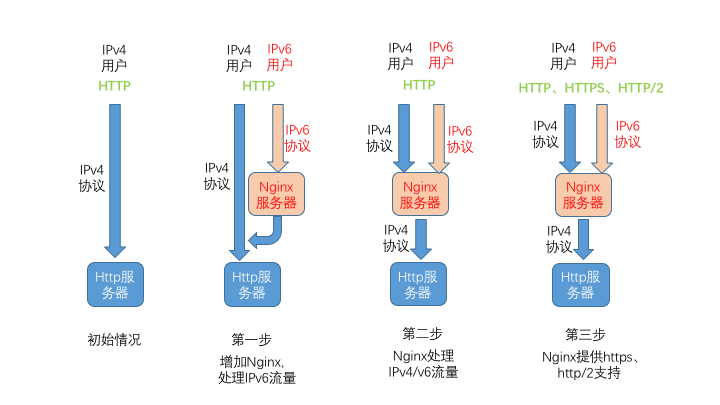

## [原创]step-by-step install Nginx反向代理服务器(Ubuntu 18.04 LTS)

本文原创：

* **中国科学技术大学 张焕杰**
* **厦门大学 郑海山**

修改时间：2018.06.13

对于仅仅支持IPv4的HTTP服务器，按下图所示步骤，通过增加Nginx反向代理服务器，可以分三步迁移为支持IPv4/v6 协议的HTTP、HTTPS、HTTP/2服务器。

步骤一--步骤十 描述了第一步的迁移过程。第二步迁移仅仅需要修改DNS服务器即可。
步骤十一 描述了第三步的迁移过程。

Nginx反向代理服务器发给HTTP服务器的请求，增加了以下字段：

* X-Real-IP: 客户端来源IP地址
* X-Forwarded-Proto: 用户请求的协议，是http或https

特别注意：如果您的HTTP服务器前有WAF设备防护，增加Nginx服务器后，WAF设备看到的访问来源IP是Nginx服务器的IP地址，而不是真实的客户端IP地址。
一旦WAF设备认为有攻击嫌疑而封锁IP，会导致Nginx服务器无法访问HTTP服务器。因此需要调整WAF设备的配置，让WAF设备把HTTP请求中的X-Real-IP字段作为来源IP地址。



## 一、Ubuntu 18.04 LTS安装

获取安装包 ISO，您可以从以下站点获取 `ubuntu-18.04-live-server-amd64.iso`，文件大小大约是806MB。

* [中国科大镜像站](http://mirrors.ustc.edu.cn/ubuntu-releases/18.04/)
* [上海交大镜像站](http://ftp.sjtu.edu.cn/ubuntu-cd/18.04/)
* [163镜像站](http://mirrors.163.com/ubuntu-releases/18.04/)

说明：Ubuntu还有个更加灵活的安装程序，安装后占用空间更少，安装过程选择更多，熟练人士可以选择 [中国科大镜像站](http://mirrors.ustc.edu.cn/ubuntu-cdimage/releases/18.04/release/)/ubuntu-18.04-server-amd64.iso，安装后大约占用1.5G空间。经测试该安装程序并不稳定。

安装完的系统占用磁盘空间为3.5G。使用物理服务器或新建虚拟机都可以。如果使用虚拟机，选择4个虚拟CPU，2G内存，40G硬盘（如果想保存更多日志可以适当加大空间）一般就够用，类型可以选Ubuntu Linux(64-bit)。

使用光盘镜像引导，按提示安装即可，一般在10分钟内完成。安装过程中有疑问，请参考 
[Ubuntu 18.04 Server 版安装过程图文详解](https://blog.csdn.net/zhengchaooo/article/details/80145744)。

如果安装时设置了网络，安装过程中会连接官方服务器获取最新的软件包，因此请保持网络畅通。

如果安装时没有设置网络，请参见下面的 二、配置网络 部分。

注意：Ubuntu 系统要求必须使用一个普通用户登录，执行需要特权的命令时，使用`sudo ....`来临时切换为root用户进行。如果需要以root身份执行较多的命令，可以使用`sudo su -`切换为root用户（虽然不建议这样做），这样一来就不需要每次输入`sudo`了。


## 二、配置网络

反向代理服务器需要IPv4/IPv6的连通性，对外需要开放22、80、443端口，如果您有防火墙，请放开这些端口。

使用安装时设置的普通用户登录系统，使用以下命令测试网络是否正常：
```bash
ip addr    		#查看网卡设置的ipv4/ipv6地址
ip route  		#查看ipv4网关
ip -f inet6 route 	#查看ipv6网关
ping 202.38.64.1  	#检查ipv4连通性
ping6 2001:da8:d800::1 	#检查ipv6连通性
```
如果网络存在问题，请按照以下说明修改配置，直到网络正常。

Ubuntu网络配置与之前的变化较大，采用netplan管理，配置文件存放在`/etc/netplan/*.yaml`。

下面是我使用的例子，文件是`/etc/netplan/50-cloud-init.yaml`，内容如下：

请根据自己的网络情况，修改文件，修改后执行`sudo netplan apply`应用即可。

```
network:
    version: 2
    ethernets:
        ens160:
            dhcp4: no
            addresses: [222.195.81.200/24,'2001:da8:d800:381::200/64']
            gateway4: 222.195.81.1
            nameservers:
                    addresses: [202.38.64.1,202.38.64.56]
```

 检查点：上述ping之类的命令测试网络正常。

网络正确配置后，可以从其他机器ssh连接Nginx服务器，以方便后续操作时，通过"拷贝-粘贴"运行命令。

# 注意：以下 步骤三--步骤七 部分有快捷脚本可用，下载后执行即可全部完成，大大节省时间，请参见 十、快捷脚本 

## 三、设置系统时区

默认安装的系统时区是UTC，以下命令可以修改为北京时间：
```
sudo timedatectl set-timezone Asia/Shanghai
```

## 四、设置防火墙

安全是第一要务，对于Nginx服务器，对外需开通80、443端口，对部分地址开通22端口以方便管理。

使用如下命令设置，请根据自己的管理地址段，替换下面的`202.38.64.0/24`
```bash
sudo ufw enable
sudo ufw allow 80/tcp
sudo ufw allow 443/tcp
sudo ufw allow proto tcp from 202.38.64.0/24 to any port 22
sudo ufw default deny
```
您可以使用命令`sudo ufw status numbered`查看设置的规则，如果设置错误，可以使用`sudo ufw delete [序号]`删除规则。

如果您有强烈的好奇心，可以执行`sudo iptables -L -nv | more`看看系统实际使用的规则。

 检查点：命令`sudo ufw status verbose`能看到设置的规则。

## 五、优化conntrack性能

Linux系统防火墙需要使用conntrack模块记录tcp/udp的连接信息，默认的设置(最多6万连接)不太适合反向代理这种服务使用。

5.1 编辑文件`sudo vi /etc/modules`，增加2行：
```bash
nf_conntrack_ipv4
nf_conntrack_ipv6
```

5.2 新建文件`sudo vi /etc/modprobe.d/nf_conntrak.conf`，增加1行(连接数是hashsize*8，按照以下设置，最多40万连接)：
```bash
options nf_conntrack hashsize=50000
```

5.3 编辑文件`sudo vi /etc/security/limits.conf`，增加4行：
```
*               soft    nofile  655360
*               hard    nofile  655360
root            soft    nofile  655360
root            hard    nofile  655360
```

5.4 新建文件`sudo vi /etc/sysctl.d/90-conntrack.conf`，内容为：
```
net.netfilter.nf_conntrack_dccp_timeout_closereq = 60
net.netfilter.nf_conntrack_dccp_timeout_closing = 60
net.netfilter.nf_conntrack_dccp_timeout_open = 200
net.netfilter.nf_conntrack_dccp_timeout_partopen = 60
net.netfilter.nf_conntrack_dccp_timeout_request = 60
net.netfilter.nf_conntrack_dccp_timeout_respond = 60
net.netfilter.nf_conntrack_dccp_timeout_timewait = 60
net.netfilter.nf_conntrack_frag6_timeout = 10
net.netfilter.nf_conntrack_generic_timeout = 60
net.netfilter.nf_conntrack_icmp_timeout = 10
net.netfilter.nf_conntrack_icmpv6_timeout = 10
net.netfilter.nf_conntrack_sctp_timeout_closed = 10
net.netfilter.nf_conntrack_sctp_timeout_cookie_echoed = 3
net.netfilter.nf_conntrack_sctp_timeout_cookie_wait = 3
net.netfilter.nf_conntrack_sctp_timeout_established = 300
net.netfilter.nf_conntrack_sctp_timeout_heartbeat_acked = 300
net.netfilter.nf_conntrack_sctp_timeout_heartbeat_sent = 30
net.netfilter.nf_conntrack_sctp_timeout_shutdown_ack_sent = 3
net.netfilter.nf_conntrack_sctp_timeout_shutdown_recd = 0
net.netfilter.nf_conntrack_sctp_timeout_shutdown_sent = 0
net.netfilter.nf_conntrack_tcp_timeout_close = 10
net.netfilter.nf_conntrack_tcp_timeout_close_wait = 10
net.netfilter.nf_conntrack_tcp_timeout_established = 600
net.netfilter.nf_conntrack_tcp_timeout_fin_wait = 60
net.netfilter.nf_conntrack_tcp_timeout_last_ack = 60
net.netfilter.nf_conntrack_tcp_timeout_max_retrans = 60
net.netfilter.nf_conntrack_tcp_timeout_syn_recv = 30
net.netfilter.nf_conntrack_tcp_timeout_syn_sent = 30
net.netfilter.nf_conntrack_tcp_timeout_time_wait = 30
net.netfilter.nf_conntrack_tcp_timeout_unacknowledged = 30
net.netfilter.nf_conntrack_udp_timeout = 10
net.netfilter.nf_conntrack_udp_timeout_stream = 30
```

设置完成后，重启系统。

 检查点：重启后执行`dmesg | grep conn`会显示最大连接数为40万，`more /proc/sys/net/netfilter/*timeout*`会显示修改后的超时时间。

 检查点：执行`ulimit -a`，显示的`open files`是655360

## 六、安装Nginx

执行`sudo apt-get install -y nginx`即可。

## 七、修改Nginx配置

建议使用Git跟踪配置的变化。

7.1 使用如下命令初始化（请修改自己的个人信息）：
```bash
sudo su -
git config --global user.email "james@ustc.educ.cn"
git config --global user.name "Zhang Huanje"

cd /etc/nginx
git init
git add *
git commit -m init
```

7.2 生成Nginx需要的随机数（需要大约几分钟以搜集足够的随机信息）：
```bash
sudo mkdir /etc/nginx/ssl
sudo openssl dhparam -out /etc/nginx/ssl/dhparam.pem 2048
```

7.3 下载配置文件模板。我们准备了一份模板，下载后稍加修改就可以使用。

```
cd /etc/nginx
sudo mv nginx.conf nginx.system.conf
sudo wget https://raw.githubusercontent.com/bg6cq/nginx-install/master/nginx.conf
```

7.4 修改配置文件`sudo vi nginx.conf`，修改最后部分的配置，改为自己的主机名、日志文件名、IP地址。

7.5 测试配置是否正确，下面是测试正确时的显示：
```
sudo nginx -t
nginx: the configuration file /etc/nginx/nginx.conf syntax is ok
nginx: configuration file /etc/nginx/nginx.conf test is successful
```

7.6 如果测试正确，执行以下命令应用配置：
```bash
systemctl restart nginx.service
```

## 八、测试

在自己机器上修改hosts文件，如下所示(请用自己的替换)：
```
2001:da8:d800:381::200 www.ustc.edu.cn
```
测试是否可以访问，并可以查看Nginx服务器上`/var/log/nginx/`下的日志文件，看到有访问记录。

## 九、启用IPv6访问

经过测试访问正常后，可以修改DNS服务器上www.ustc.edu.cn的信息，增加

```
www	IN	AAAA	2001:da8:d800:381::200
````
这样就能观察到IPv6的访问，您也可以到 [http://ipv6-test.com/validate.php](http://ipv6-test.com/validate.php) 处输入自己的网站地址测试IPv6的HTTP是否可以正常工作。

正常工作后，可以将配置文件的变更在git中提交，命令是：
```bash
sudo su -
cd /etc/nginx
git add nginx.conf
git commit -m "www.ustc.edu.cn ok"
```

## 十、快捷脚本

以上 三---七 部分，有快捷脚本可用，只要完成"二、网络配置"，网络畅通时，执行以下脚本即可完成大部分配置，只要修改配置文件即可。

注意，执行脚本时，请根据自己的信息替换命令行参数(命令行中202.38.95.0/24是将来允许使用ssh登录服务器的网段)。

```
sudo su -
cd /
wget http://202.38.64.1/install-nginx.sh

bash ./install-nginx.sh yes 202.38.95.0/24 james@ustc.edu.cn "Zhang Huanjie"
```

执行完脚本，重新启动，然后请参考 7.4 修改配置和后续工作

## 十一、HTTPS支持

警告：上海交大 章思宇 老师提醒，如果仅仅使用Nginx处理IPv6流量并支持HTTPS访问，同时处理IPv4流量的服务器不支持HTTPS，这时开通IPv6流量的HTTPS可能会带来负面影响，原因是有些搜索引擎会通过v6收录HTTPS的链接，导致v4用户不能访问。

避免这种情况出现需要在v4/v6上同时支持HTTPS访问，其中最简单的方式是把所有流量经过Nginx代理。中国科大已经这样用了10多年，在一台Nginx服务器上对教育网、电信、联通、移动出口提供服务，运行稳定。

假定 http://testsite.ustc.edu.cn 需要增加https支持，步骤如下：

注：以下命令均在`sudo su -`后执行

11.1 下载getssl，准备环境

`/etc/nginx/ssl/web`是用来存放Let's Encrypt要用到随机数的目录

```bash
mkdir /etc/nginx/ssl/web
cd /etc/nginx
curl --silent https://raw.githubusercontent.com/srvrco/getssl/master/getssl > getssl ; chmod 700 getssl
```

11.2 在`/etc/nginx/nginx.conf`中增加 testsite.ustc.edu.cn 的配置，如下所示：
```
        server {
                listen 80 ;
                listen [::]:80 ;
                server_name testsite.ustc.edu.cn;
                access_log /var/log/nginx/host.testsite.ustc.edu.cn.access.log main;
                location / {
                        proxy_pass http://202.38.64.40/;
                }
                location /.well-known/ {
                        root /etc/nginx/ssl/web/;
                }
        }
```

测试配置正常后，应用
```
nginx -t && service nginx restart		#这条命令也是可用的
```

11.3 生成并修改getssl配置

生成配置(-U的含义是不检查getssl是否有新版本，会略快)：
```
cd /etc/nginx
./getssl -U -c testsite.ustc.edu.cn
```

会生成配置文件`/root/.getssl/getssl.cfg`和`/root/.getssl/testsite.ustc.edu.cn/getssl.cfg`

编辑文件`vi /root/.getssl/getssl.cfg`，修改3个地方（邮件是为了获取证书即将到期的通知）
```
CA="https://acme-v01.api.letsencrypt.org"
ACCOUNT_EMAIL="james@ustc.edu.cn"
#CHECK_REMOTE="true"
ACL=('/etc/nginx/ssl/web/.well-known/acme-challenge')
USE_SINGLE_ACL="true"
```

编辑文件`vi /root/.getssl/testsite.ustc.edu.cn/getssl.cfg`，内容为：
```
DOMAIN_KEY_LOCATION="/etc/nginx/ssl/testsite.ustc.edu.cn.key"
DOMAIN_CHAIN_LOCATION="/etc/nginx/ssl/testsite.ustc.edu.cn.pem"
```

11.4 获取证书

执行如下命令获取证书(-d是调试开关，可以显示更多的调试信息):
```
cd /etc/nginx
./getssl -U -d testsite.ustc.edu.cn
```
执行完毕后，会产生2个文件`/etc/nginx/ssl/testsite.ustc.edu.cn.key`和`/etc/nginx/ssl/testsite.ustc.edu.cn.pem`。

11.5 使用证书

修改nginx.conf文件，对应的配置如下：
```
        server {
                listen 80 ;
                listen [::]:80 ;
                listen 443 ssl http2;
                listen [::]:443 ssl http2;
                server_name testsite.ustc.edu.cn;
                ssl_certificate /etc/nginx/ssl/testsite.ustc.edu.cn.pem;
                ssl_certificate_key /etc/nginx/ssl/testsite.ustc.edu.cn.key;
                add_header Strict-Transport-Security $hsts_header;
                access_log /var/log/nginx/host.testsite.ustc.edu.cn.access.log main;
                location / {
                        proxy_pass http://202.38.64.40/;
                }
                location /.well-known/ {
                        root /etc/nginx/ssl/web/;
                }
        }
```

11.6 测试配置正常后，应用

```
nginx -t && systemctl restart nginx.service
```

这时可以通过 https://testsite.ustc.edu.cn 访问，也可以使用[SSL Labs](https://www.ssllabs.com/ssltest/analyze.html)测试网站的SSL得分情况。


正常工作后，可以将配置文件的变更在git中提交，命令是：
```bash
sudo su -
cd /etc/nginx
git add nginx.conf
git commit -m "https://testsite.ustc.edu.cn ok"
```

11.7 证书更新

Let's Encrypt 证书有效期为90天，建议在60天时进行更新，更新的命令是；
```
cd /etc/nginx
./getssl -U testsite.ustc.edu.cn
nginx -t && systemctl restart nginx.service
```

11.8 强制用户使用https访问

上述设置，只要用户访问过 https://testsite.ustc.edu.cn ，在604800秒，即7天内，总是会用https方式访问。

如果HTTPS运行稳定，可以强制useragent带有Mozila/5.0(较新的浏览器)的访问强制使用https访问，将配置改为如下：

```
        server {
                listen 80 ;
                listen [::]:80 ;
                server_name testsite.ustc.edu.cn;
                access_log /var/log/nginx/host.testsite.ustc.edu.cn.access.log main;
		location / {
			location / {
                        if ( $http_user_agent ~ "(Mozilla/5.0)" ) {
                                return  301 https://$server_name$request_uri;
                        }
                        proxy_pass http://202.38.64.40/;
                }
                location /.well-known/ {
                        root /etc/nginx/ssl/web/;
                }
        }
        server {
                listen 443 ssl http2;
                listen [::]:443 ssl http2;
                server_name testsite.ustc.edu.cn;
                ssl_certificate /etc/nginx/ssl/testsite.ustc.edu.cn.pem;
                ssl_certificate_key /etc/nginx/ssl/testsite.ustc.edu.cn.key;
                add_header Strict-Transport-Security $hsts_header;
                access_log /var/log/nginx/host.testsite.ustc.edu.cn.access.log main;
                location / {
                        proxy_pass http://202.38.64.40/;
                }
        }
```

11.9 Let's Encrypt 证书的数量和频度限制

对使用影响最大的是Let's Encrypt 证书的频度限制，每7天仅仅允许申请20个证书，到达这个限制后，已有的证书仍旧可以更新。

因此如果域名下有大量网站需要代理，可以使用 \*.ustc.edu.cn 之类的通配符证书，申请一个证书供多个网站使用。

## 十二、Nginx状态监视

Nginx运行时的连接信息对运行很有用，下面的操作完成后，可以提供类似 [http://202.38.64.1/nginx](http://202.38.64.1/nginx/) 的统计图。

注：以下命令均在`sudo su -`后执行

```bash
mkdir /usr/share/nginx/html/status/
apt-get install -y librrds-perl libwww-perl rrdtool
wget https://raw.githubusercontent.com/bg6cq/nginx-install/master/rrd_nginx.pl -O /etc/nginx/rrd_nginx.pl
wget https://raw.githubusercontent.com/bg6cq/nginx-install/master/status_index.html -O /usr/share/nginx/html/status/index.html

rrdtool create /usr/share/nginx/html/status/nginx.rrd -s 60 \
         DS:requests:COUNTER:120:0:100000 \
         DS:total:GAUGE:120:0:60000 \
         DS:reading:GAUGE:120:0:60000 \
         DS:writing:GAUGE:120:0:60000 \
         DS:waiting:GAUGE:120:0:60000 \
         RRA:AVERAGE:0.5:1:2880 \
         RRA:AVERAGE:0.5:30:672 \
         RRA:AVERAGE:0.5:120:732 \
         RRA:AVERAGE:0.5:720:1460
```
然后执行`crontab -e`设置以下定时任务：
```
* * * * * perl /etc/nginx/rrd_nginx.pl
```
过一会，就可以使用 http://x.x.x.x/status (x.x.x.x是Nginx服务器IP地址) 查看状态页面。

如果仅仅允许部分IP查看状态页面，可以修改nginx.conf中，增加IP地址限制。

如果都工作正常，可以把相关修改在git中提交，命令是：
```bash
sudo su -
cd /etc/nginx
git add rrd_nginx.pl
git commit -m "rrd_nginx"
```

## 十三、系统和软件的更新

一直到2023年，Ubuntu都会为 Ubuntu 18.04 LTS提供软件更新服务。只要执行以下命令，即可将系统中软件更新：
```
sudo apt-get update
sudo apt-get upgrade
```


***
欢迎 [加入我们整理资料](https://github.com/bg6cq/ITTS)
